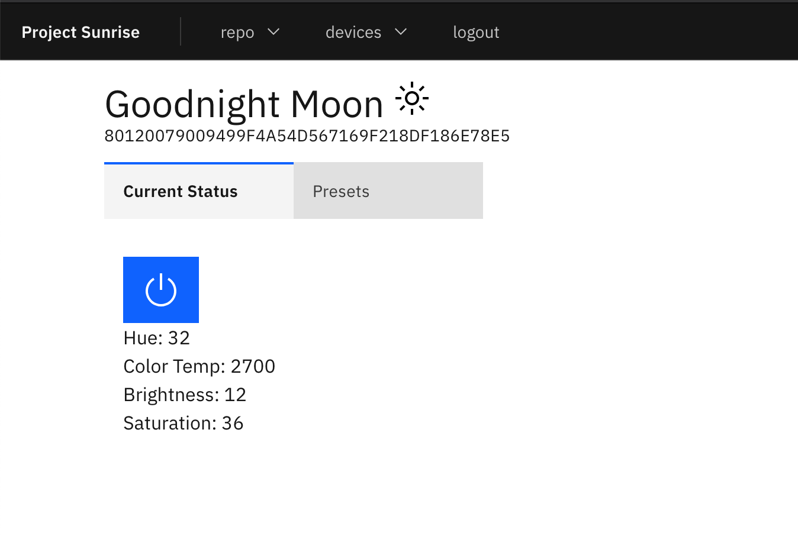

# Sunrise

A small project to enable a pleasant morning sun rise via IOT lights.



## Frontend (JavaScript React app)

### Links

- [create react app with typescript docs](https://create-react-app.dev/docs/adding-typescript)
- [IBM carbon storybook](https://react.carbondesignsystem.com/?path=/story/radiobutton--default)
- [styled-components docs](https://styled-components.com/docs/)
- [Create React App documentation](https://facebook.github.io/create-react-app/docs/getting-started)
- [React documentation](https://reactjs.org/)

### Dev Setup

The frontend create react app is located in the `/frontend` dir. Development is done via the create
react app dev server that hosts on ex `localhost:3000`. The dev setup relies on also running a json
mock server that serves a fake backend for development purposes on `localhost:3001`.

**To start the json mock server:**
```shell
$ cd frontend
$ npm run mockBackend
```

**To start the react dev server:**
```shell
$ cd frontend
$ npm run start
```

**To build the app and copy it over to the place in the backend folder where it can be served by python run:**
```shell
$ cd frontend
$ npm run build:toBackend
```

## Backend (Python Flask app)

### Links

- [learn x in y min -- python](https://learnxinyminutes.com/docs/python/)
- [flask docs](https://flask.palletsprojects.com/en/1.1.x)
- https://blog.miguelgrinberg.com/post/the-flask-mega-tutorial-part-ii-templates
- [why pipenv](https://realpython.com/pipenv-guide/#problems-that-pipenv-solves)

### Dev Setup

The python 3 flask app resides under the `/backend` dir. It is responsible for serving the frontend
(HTML and JavaScript), and communicating with the tp-link api. To get it up and running on local
follow:

1. create a virtual environment for the project
```shell
$ cd backend
$ python3 -m venv venv
```

2. activate the virtual environment from in the `/backend` dir. You should see the shell prefixed with `(venv)` if it worked
```shell
$ source ./venv/bin/activate
$ (venv)
```

3. install dependences
```shell
$ (venv) pipenv install --dev
```

4. run app with live reload
```shell
$ (venv) FLASK_APP=sunrise.py flask run --reload
```

Thats it should have a full operational python app running on local

If you need to install further packages run:

```shell
$ pipenv install requests
```

or if they are only for development


```shell
$ pipenv install autopep8 --dev
```

afterward make sure to lock and commit changes to the `PipFile.lock`:

```shell
$ pipenv lock
```

### TP-Link API

Could not find actual documentation on the TP-link api. We make everything from looking at other
projects and probing the api with [Insomnia](https://insomnia.rest/).

- https://github.com/konsumer/kasa_control/blob/master/src/lib.js
- https://github.com/konsumer/tplink-lightbulb/blob/master/src/lib.js

Also included a [insomnia enverioment json](sunrise_2020-04-18.json) that can be inproted into insomnia

## Versioning

This entire app both frontend and backend are version together, a git tag is created and a docker
image tagged to the version. Versioning follows the [Semantic
Versioning](https://semver.org) convention.  Versions can be seen in the [CHANGELOG](CHANGELOG.md)
or under [tags](https://gitlab.com/BTBTravis/sunrise/-/tags). In order to make this possible we
ask our developers to:

- Follow [conventionalcommits](https://www.conventionalcommits.org/) convention when committing
    - ex. feat(caching): add second cache key
    - ex. fix(time_calc): multiple to get seconds
    - ex. docs: init README.md
    - ex. refactor: init pprint module for printing json
    - ex. test(remote_api): test valid cache flow
    - ex. deploy(0.0.1): ship mvp
- If PR makes significant changes bump version
- When bumping version make sure to update [CHANGELOG](CHANGELOG.md) and apply tag to deploy commit that updates [deployment.yml](deploy/deployment.yml)
    - ex. deploy(0.0.1): ship mvp


## How to deploy

Currently deployment is handled manually.

1. build the frontend into the backend folder and test
```script
$ cd frontend
$ npm run build:toBackend
```

2. build docker image
```shell
$ cd backend
$ docker build -t registry.gitlab.com/btbtravis/sunrise:0.0.2 -f ./deploy/Dockerfile .
```

3. push docker image to container repository
```shell
$ docker push registry.gitlab.com/btbtravis/sunrise:0.0.2
```

4. bump version in [/backend/deploy/deployment.yml](backend/deploy/deployment.yml)
```diff
diff --git a/deploy/deployment.yml b/deploy/deployment.yml
index 4595860..0ae4bfe 100644
--- a/deploy/deployment.yml
+++ b/deploy/deployment.yml
@@ -43,7 +43,7 @@ spec:
-        image: registry.gitlab.com/btbtravis/sunrise:0.0.1
+        image: registry.gitlab.com/btbtravis/sunrise:0.0.2
         imagePullPolicy: IfNotPresent
         name: corona-cal-api
         ports:
```

5. update image in live deployment
```shell
$ kubectl apply -f ./deploy/deployment.yml
```
